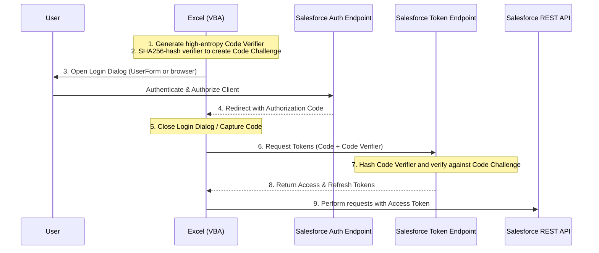

# Salesforce OAuth2 PKCE Authenticator - VBA Design Document

This document provides a detailed design for implementing a native Visual Basic for Applications (VBA) solution to authenticate with Salesforce via OAuth 2.0 Web Server Flow with PKCE (Proof Key for Code Exchange).

---

## 1. OAuth 2.0 PKCE Flow Overview

PKCE (RFC 7636) is an extension to the authorization code flow to prevent authorization code interception attacks on public or native clients (like Excel/VBA). 



---

## 2. VBA Module-Wise Architecture

To keep the codebase maintainable and reusable, we divide the functionality into five distinct modules and one UserForm.

```
c:\Users\703134581\projects\PKCE Connector  Salesforce\
├── docs\
│   └── VBA_Salesforce_PKCE_Design.md
├── src\
│   ├── CryptoUtils.bas
│   ├── JSONParser.bas
│   ├── SalesforceOAuth2.bas
│   ├── SalesforceAPI.bas
│   ├── frmOAuthLogin.frm
│   ├── frmOAuthLogin.frx
│   ├── OAuthDemo.bas
│   └── VBA_Tests.bas
├── change_doc.md
└── README.md
```

### Module 1: `CryptoUtils`
Responsible for cryptography using Windows native APIs (`bcrypt.dll`). This ensures compatibility with both 32-bit and 64-bit Office versions without external dependencies (like .NET COM Interop).
- **`GenerateCodeVerifier(Optional Length As Long = 64) As String`**: Generates a high-entropy string containing characters `[A-Za-z0-9-._~]`.
- **`GetSHA256Hash(InputStr As String) As Byte()`**: Returns the SHA256 byte array hash of a string using Windows CNG BCrypt APIs.
- **`Base64URLEncode(ByteArray() As Byte) As String`**: Encodes a byte array into a URL-safe Base64 string (swaps `+` to `-`, `/` to `_`, and removes `=`).
- **`GenerateCodeChallenge(CodeVerifier As String) As String`**: Wraps the hashing and encoding to produce the code challenge.

### Module 2: `JSONParser`
VBA lacks a native JSON parser. To avoid requiring external references or complex installations, we implement a lightweight string-matching state machine parser.
- **`ParseJSON(JSONString As String) As Object`**: Parses a flat JSON string into a Scripting.Dictionary of key-value pairs.

### Module 3: `SalesforceOAuth2`
Core orchestrator for the PKCE OAuth process.
- **`GetAuthorizationUrl(ClientId As String, RedirectUri As String, Challenge As String, Optional State As String = "", Optional LoginDomain As String = "login.salesforce.com") As String`**: Assembles the initial OAuth URL.
- **`RequestTokens(ClientId As String, RedirectUri As String, CodeVerifier As String, AuthCode As String, Optional LoginDomain As String = "login.salesforce.com") As Object`**: Makes the POST request to exchange the code for tokens.
- **`RefreshAccessToken(ClientId As String, RefreshToken As String, Optional LoginDomain As String = "login.salesforce.com") As Object`**: Refreshes expired access tokens.

### Module 4: `SalesforceAPI`
Simplifies HTTP REST queries.
- **`ExecuteRequest(Method As String, InstanceUrl As String, Endpoint As String, AccessToken As String, Optional Body As String = "") As String`**: Sends API requests containing the Authorization header.

### UserForm: `frmOAuthLogin`
Provides the UI container for authorization. Contains a WebBrowser control and hooks the redirect event to catch the auth code. Falls back to System Browser + InputBox if ActiveX is disabled.
- **`InitLogin(AuthUrl As String, RedirectUri As String) As String`**: Displays the form and returns the captured authentication code.
